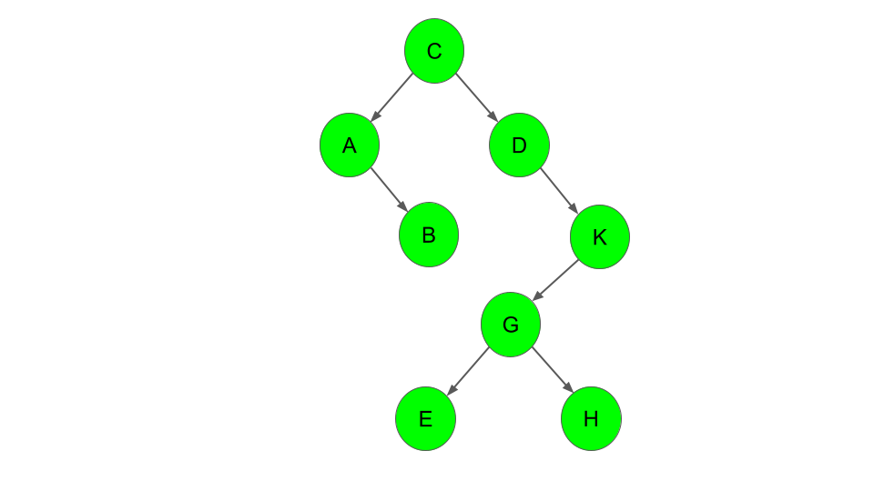

# Type-safe polymorphic binary search tree (BST) implementation using Java 17  
  
This is an exercise to implement a type-safe polymorphic (unbalanced) BST in a thread-safe way using Java `Generics`, `Optional`, and `Record`.  Being a BST, the time complexity for searching, insertion and deletion are as follows:
- average case: O(h) where h is the height of the tree
- worst case: O(n) where n is the number of nodes
  
Using both iterative and recursive approaches, the tree implements the following methods:  
1. Add item; the item is discarded if it already exists.
1. Remove item
1. Maximum item
1. Minimum item
1. Height
1. In-order depth-first traversal
1. Pre-order depth-first traversal
1. Post-order depth-first traversal
1. Breadth-first traversal

The only requirement for data to be stored being the item class must implement the Java *Comparable* interface.  

You need to have Java 17 installed to build the project. Go to the project folder and type `./gradlew build`.  
  
To run a quick demo, type `./gradlew run` or `java -jar build/libs/binary-tree.jar`.  
  
The demo builds the tree as per the following snippet:

```java
        tree = add(tree, "C");
        tree = add(tree, "D");
        tree = add(tree, "A");
        tree = add(tree, "B");
        tree = add(tree, "A");
        tree = add(tree, "K");
        tree = add(tree, "G");
        tree = add(tree, "E");
        tree = add(tree, "H");
```

The sequence above yields the following tree:  
  
  


